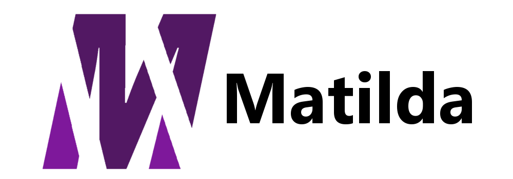

</img>
Matilda is a new programming language that's not designed to be unique or groundbreaking. Instead, Matilda takes already 
established technologies and paradigms and just makes them **nicer**.

## Example
This is a very trivial example, but it displays Matilda's philosophy quite well. Take a simple matching function:

**Python**:
```
def equals(x, y):
    return x == y

if equals(2, 2): print("true")
```

**Matilda**:
```
fun (x) equals (y):
    return x == y
end

if 2 equals 2: print "true"
```

Matilda has taken traditional syntax (function calls), but has made it infinitely nicer.

Another fantastic feature supported in Matilda is optional typing - you can make the most of both static typing and dynamic 
typing in the same language, abolishing the need for confusing generics and templates and allowing rapid prototyping and 
development.
```
var dynamic = 2
dynamic = "foo"

int static = 2
static = "foo" // Error!

fun takeStaticDynamic(x, int y):
    print x
    print y + 1 // We know that y is an int
end
```
